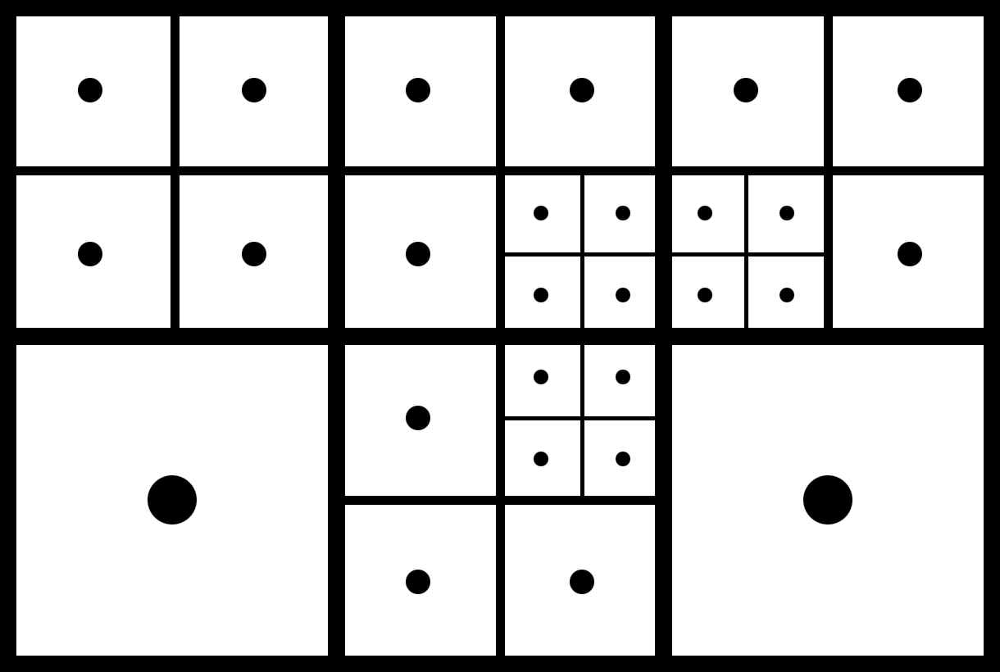
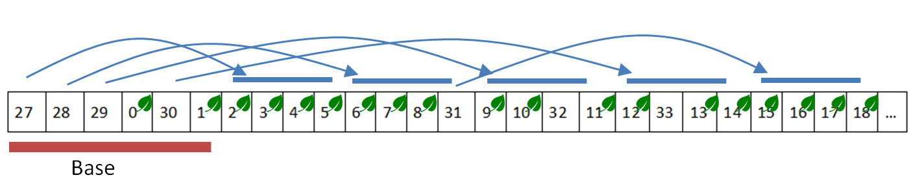

Fei Yang

Mar. 2023

# Introduction 

This article introduces an experimental feature of the open-source project [Three.V8]( https://github.com/fynv/Three.V8), namely Mixed-resolution Grid of Light Probes (or LODProbeGrid which is used for coding).  Three.V8 is a 3D rendering engine and application framework that integrates Google's V8 JavaScript engine, so that games and applications can be coded in JavaScript, while the 3D rendering part is based on the full-featured, native graphics APIs. The LODProbeGrid is a global illumination component of Three.V8, which is evolved from Uniform Grid of Light Probes, the latter is a simple and widely used GI structure. Comparing to the uniform grid, the proposed mixed-resolution gird is more compact in storage. It maintains less number of light probes while still meeting the same requirement of probe density.

The technique mainly tackles with the issue that the requirement of probe density is often varying across the scene, because of the uneven distribution of geometry. An uniform grid of probes can be inefficient when such a requirement is present.  An uniform grid only have a fixed density everywhere, therefore, it often ends up either containing much more probes than necessary (oversampling), or use a lower density than necessary (undersampling). In view of such deficiency of an uniform grid, we propose a mixed-resolution, non-uniform grid for probe placement. We will introduce an algorithm to decide the level of subdivision for different areas of space, which will construct the structure of the grid automatically according to the geometry distribution of the scene. At the same time, because of the change to the probe grid structure, we also have to adopt a modified probe sampling scheme during rendering.

It is clear that the technique can increase the efficiency of storage and network transfer of pre-computed GI information, because of the reduced amount of data. It also reduces the time needed for GI data preparation, because of the reduced total number of probes. However, it is also observed that there is some minor performance loss at runtime on some devices, due to the increased complexity of data structure. Therefore, for performance sensitive uses, we offer an option to convert a mixed-resolution grid of light probes to an uniform grid, which can be done any time before applying it to a scene.

While the technique could potentially have more use-cases, such as using it together with GPU accelerated ray-tracing for dynamic global illumination, we are currently unable to evaluate these scenarios because of the setup of Three.V8, which is mobile targeted and doesn't contain a ray-tracing system. Here we provide the details of the technique, so that it will be easy for people to implement and test it if they are interested in other application scenarios.

# Related Techniques

## Spherical Harmonics

Spherical harmonics are ideal for representing a low-frequency spherical function like irradiance information[[3]](#3). They are extremely compact. Order 3 SH only consists of 9 spherical harmonics basis functions. The spherical harmonics basis functions are linear. When we need to interpolate the irradiance function at some spatial point, we can just calculate a linear combination of the SH coefficients.

We use spherical harmonics to approximate the irradiance function at different spatial locations. While it would have been much easier to do it using ray-traced samples, in this work, we are using a 2 step approach. First rendering to a cube-map, then convert the cube-map to SH coefficients. We use the methods described in [[4]](#4) and [[5]](#5) for the 2nd step.

## Uniform Grid of Light Probes

The simplest form of GI could be using pre-computed irradiance probes distributed in a uniform grid. It is the easiest for shaders to look up the nearest probes around a spatial point, and perform trilinear interpolation. 

Uniform grids of probes are used in NVIDIA's DDGI[[1]](#1) and related works[[2]](#2). The interpolation and weighting scheme proposed in these works, including the visibility test using distance information, has largely resolved the artifacts seen in earlier uniform grid systems, and made it robust to a large range of different environments. In this work, we derive our probe interpolation and weighting scheme based on the tricks used in DDGI for our mixed resolution grid, while restricting to precomputed GI only.

## Image MIP-mapping

When using a uniform grid of irradiance probes represented in SH form, it is easy to consider it as a 3D volumetric image with 9xRGB channels. The trilinear interpolation we use for the probes is also similar to what we do with images. Therefore, it is natural to consider to use techniques developed for images to handle the problem of probe grids.

The issue we currently have with a probe grid is the varying requirement of resolution because of the uneven distribution of geometry, which is basically a level-of-detail problem. For images, we have mip-maps to handle it. For image mip-mapping, we normally down-sample a high-resolution image to half of its dimensions each time, forming a series of images with decreasing sizes. Vertically looking, it can also be seen as a quadtree(for 2D) or an octree(for 3D) hierarchical structure. 

When there is a varying requirement of resolution, 2x2 blocks of pixels from different resolution levels can be compactly packed together, forming an image of mixed resolution. When we are sampling a continuous function, the forming of a mixed resolution grid can be done reversely. We first divide the space with a low resolution "base" grid, so we can sample at the center of each cell. Then by selectively subdividing some of the cells, we get sampling locations of a higher level of resolution, which replace the low resolution samples. This is what we are going to do with the probe grid.


## Voxelization

Voxelization techniques extract information from a 3D-scene composed of meshes into a volumetric structure. The most efficient way to do voxelization is through rasterization and random texture write operations. While it is possible to develop global illumination techniques directly based on voxelization, in this work, we are using it only for acquiring geometry distribution information, which can help us decide which probe grid cells should be sub-divided.


# The Mixed Resolution Grid

Our mixed resolution grid of probes consists of probes from a mixed levels of resolution. The base level grid is specified by user interactively. Then some of the grid cells are selectively subdivided, and each one of the corresponding low-resolution probes is replaced by 8 probes of a higher resolution level. Voxelization is used in order to decide which cells to be subdivided. A constructed mixed resolution grid can be sampled by shaders using a scheme similar to the one used in DDGI with modifications in order to adapt to the difference of the grid structure.

We first overview what the structure of a constructed mixed resolution grid looks like. Then we go into details how the grid is constructed. Finally, we explain how to sample the irradiance value from a constructed grid.


## The Grid Structure



The picture shows a mixed resolution grid in 2D form. The base(0th) level of the grid has a 3x2 division. 4 of the 6 base cells are subdivided into 16 subcells of the 1st level, then 3 of the 16 1st level cells are subdivided into 12 subcells of the 2nd level. Note that each probe is located at the center of its cell, following the same pattern of textures. With only 27 probes, the mixed resolution grid can possibly provide the same effective resolution that a 12x8 uniform grid can provide, if the presented way of subdivision is consistent with the underlying geometries.

For RAM storage, a mixed-resolution grid of light probe consists of the following data items.

* `vec3 coverage_min`: world space coordinate of the minimum position.
* `vec3 coverage_max`: world space coordinate of the maximum position.
* `ivec3 base_divisions`: divisions of the base level grid.
* `int sub_division_level`: maximum level of subdivisions. The logical resolution of the grid would be `base_divisions * (1<<sub_division_level)`.
* `vector<vec4> probe_data`: linear array of probe data. 10 x vec4 for each probe. The first vec4 stores the world-space position of the probe in its xyz channels, and the resolution level in its w channel. The other 9 vec4 stores its SH-Coefficients.
* `vector<uint16> visibility_data`: 2D visibility(distance) data packed in the same way as DDGI does, which can be transferred to a GPU texture directly. (See sec.3 of [[1]](#1)) Visibility of each probe is represented using a 16x16x2x16bit texture tile. The only difference is that we store the distances and distance standard variances in normalized integer form instead of using half-precision float.
* `vector<int> index`: index array representing the grid structure. 

Each item of the `index` array is corresponding to an octree node, either a leaf node or not. For a leaf node at `i`, `index[i]` stores index of the probe. Corresponding probe data starts from `probe_data[index[i]*10]`. 
For a non-leaf node at `i`, `index[i]` stores the index of a subdivided node + `probe_count`, where `probe_count` is the number of probes. Index information of its 8 children can be found in `index` starting from `index[base_count + (index[i]-probe_count)*8]`, where `base_count = base_divisions.x * base_divisions.y * base_divisions.z`. 



We still use our 2D case for example. Remember we have 27 probes, so an `index[i]<27` is a leaf node, and the index points to the probe. For `index[i]>=27`, we can look for its children at `index[6 + (index[i]-27) * 4]`.

Before rendering, the `index` data is transferred to GPU buffer as is, which can be traversed by the shaders. The `probe_data` is also transferred GPU, from which we can get the probe position, level and SH data. The SH data can be linearly combined by shader before evaluating the irradiance. However it is 9 colors which is a little bit heavy. Therefore we insert an irradiance pre-sampling pre-process step to convert each SH probe to a 8x8x32bit(GL_R11G11B10F) texture tile, which is the form how DDGI stores its irradiance data (sec.3 of [[1]](#1)). 

## Constructing the Grid

The mixed-resolution grid of light probe can pre-computed during data preparation.

A crucial step of constructing a mixed-resolution grid is to decided which cells of each level should be subdivided to the next level. To that purpose, we use voxelization to figure out which subdivisions are necessary. A necessary subdivision is one that, after the subdivision, there are some pairs of sub-cells located at two different sides of some triangle faces. If all sub-cells are at the same side of the geometries, then that subdivision is not necessary to happen. Also, if a subdivision is identified as necessary, then the base-cell should exist in the first place, so its parent is necessary to be subdivided as well. 

We perform the voxelization at the highest resolution `base_divisions * (1<<sub_division_level)`. We need the information whether there is some triangle passing through 2 neighboring cells. We store the information in a 3D-Texture format. We use GL_R8UI as the pixel format and only use its 3 least-significant-bits, corresponding to the intersecting state of -x, -y and -z directions of a cell. The voxelization is done in 3 passes along the 3 axis. The shaders for the x direction look like:

```c
// vertex shader - x
layout (location = 0) in vec3 aPos;

layout (std140, binding = 0) uniform Model
{
	mat4 uModelMat;
	mat4 uNormalMat;
};

layout (location = 0) uniform vec3 uCoverageMin;
layout (location = 1) uniform vec3 uCoverageMax;

void main()
{
	vec4 wolrd_pos = uModelMat * vec4(aPos, 1.0);
	vec3 clip_pos = (wolrd_pos.xyz - uCoverageMin)/(uCoverageMax - uCoverageMin) * 2.0 - 1.0;
	gl_Position = vec4(clip_pos.y, clip_pos.z, clip_pos.x, 1.0);
}
```

```c
// fragment shader - x
layout (location = 2) uniform int uDiv;
layout (binding=1, r8ui) uniform uimage3D uTexVol;

void main()
{
	vec3 coord = gl_FragCoord.xyz;
	coord.z = floor(coord.z * float(uDiv) + 0.5);
	ivec3 icoord = ivec3(coord);
	if (icoord.z>=0 && icoord.z<uDiv)
	{
		uint v = imageLoad(uTexVol, icoord.zxy).x;
		v+=1;
		imageStore(uTexVol, icoord.zxy, uvec4(v));	
	}
}
```
After the x-pass, the LSB of a voxel should be set to 1 if there is a triangle passed between the cell and the previous cell in its -x direction.

After the voxelization, we build a 3D volume for each of the `0 ~ sub_division_level - 1` levels of the grid, storing whether a cell should be divided. We just scan the volume generated by the voxelization. For each axis direction, if the corresponding bit-mask is set, we look at `sub_division_level - level` least-significant-bits of the voxel coordinate, if any of the bits is set, then the subdivision of the cell at that resolution level is necessary, and the corresponding voxel is set to `true`. 

The next step is to traverse all the cells that should be subdivided using BFS, and populate the `probe_data` and `index` arrays progressively. For `probe_data`, only the first `vec4` of each probe is stored. The SH-Coefficients are set to zeros. 

Steps until here is called `initialize()` in Three.V8, related code can be found in "LODProbeGrid.cpp". After the initialization, the octree structure of the grid is constructed. But we still need to construct the visibility data and SH-Coefficients. 

For visibility data, we cast a ray from each probe to its 16x16 directions using the octahedral mapping [[6]](#6). Since we don't have GPU ray-tracing enabled in our code, here a [BVH accelerated CPU ray-caster](https://github.com/madmann91/bvh) is used instead. Then we filter the distances and squared-distances the same way as DDGI does. Since that the kernel for visibility has a high-order of diminishment, only the 8-neighboring rays need to be considered. Using filtered(average) distance and filtered squared-stances, standard-variation can be calculated. We then normalize the average distances and standard-variations using the maximum distance affected by the probe in the sampling directions before packing the values to a texture tile. The related code can be found in `construct_visibility()` in "LODProbeGrid.cpp".

SH-Coefficients needs to be baked iteratively, which involves the whole rendering pipeline. In each iteration, we update each of the probes successively. For each probe, we first render to a cube-map with camera centered at the probe location. The resolution is 64x64 for each face, which could be lower, but we see no obvious speed-up. Then we process the cube-map using method described in [[4]](#4) and [[5]](#5) to get the SH-Coefficients. This step is obviously inefficient using current method, and should be replaced by a ray-cast based method in the future.

## Sampling the Grid

As described previously, a constructed mixed-resolution grid has a logical resolution of `base_divisions * (1<<sub_division_level)`. Basically, we can sample that logical grid just like sampling an uniform grid. In Three.V8, we use similar code to sample a mixed_resolution grid (LODProbeGrid) as to sample an uniform grid (ProbeGrid), with some modifications. Both can be found in "StandardRoutine.cpp"

For a given position of a logical probe `ivec3 ipos`, we need to get the index of an actual probe, which involves traversing the `index` data. First, we can find a cell in the base grid. The position `ipos_base = ipos / (1<<sub_division_level)`. This is where the traversal starts. For each non-leaf cell, we move on to one of its 8 children using bit values from `ipos` until a leaf is found. `get_probe_idx()` in the shader code implements the algorithm.

The interpolation and weighting part is the same as an uniform grid, which follows the tricks used in the DDGI. First reduce the weight of back-face probes using the dot-product of probe direction and the surface normal. Then the visibility weight is multiplied in, which is calculated using mean- and variance-biased Chebyshev interpolants (sec.5.2 of [[1]](#1)). Finally the trilinear interpolation weights are applied. The actual positions of the probes are used instead of the logical positions, except for the trilinear interpolation.

## Conversion to Uniform Grid

Some minor performance loss is observed on some devices comparing to using a uniform grid. The reason is complicated. First there are indeed some more global buffer fetches during the traversal of `index`. Second, the deduction of probe index by traversing `index` may have made the succeeding access pattern less predictable. In case this becomes an issue, here we offer an option to convert a mixed-resolution grid of probes to an uniform grid of probes.

The process is straight forward. First, it is quite safe to just duplicate the SH-Coefficients from a low-resolution cell to its children, because there is no geometry in between. As to visibility data, we can copy it if the cell is at the highest resolution level. If not, then we reconstruct it at the uniform grid location.

# Results


# Conclusion


# References
<a id="1">[1]</a> 
Majercik Z., Guertin J.P., Nowrouzezahrai D. AND McGuire M. 2019. Dynamic Diffuse Global Illumination with Ray-Traced Irradiance Fields. Journal of Computer Graphics Techniques.

<a id="2">[2]</a> 
McGuire M., Mara M., Nowrouzezahrai D. AND Luebke D. 2017. Realtime
global illumination using precomputed light field probes. In Proceedings of the 21st
ACM SIGGRAPH Symposium on Interactive 3D Graphics and Games.

<a id="3">[3]</a> 
Ramamoorthi R., Hanrahan P. 2001. An efficient representation for irradiance environment maps. SIGGRAPH '01: Proceedings of the 28th annual conference on Computer graphics and interactive techniques.

<a id="4">[4]</a> 
Sloan P. P. 2008. Stupid Spherical Harmonics (SH) Tricks. GDC Lecture.

<a id="5">[5]</a> 
Sloan P. P. 2013. Efficient Spherical Harmonic Evaluation. Journal of Computer Graphics Techniques.

<a id="6">[6]</a> 
Cigolle, Z. H., Donow, S., Evangelakos, D., Mara, M., Mcguire, M., AND Meyer, Q. 2014. A survey of efficient representations for independent unit vectors. Journal of Computer Graphics Techniques (JCGT)
